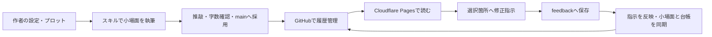

# darask-novel-writing-system

**GitHubに原稿を置き、執筆スキルで書き、Cloudflareの校閲画面から作者の修正指示を返す、日本語小説の制作環境。**

『Remission Online』で使っている `main / plot / wiki / feedback` の運用を、ほかの作品でも始められるようにまとめました。作品リポジトリを作るPythonコマンド、4つの執筆スキル、スマホでも使える校閲リーダー、Cloudflare Pages Functionsの送信API、ビルドとGitHub Actionsを含みます。



## すぐに始める

Python 3.11以上とGitを使います。Pythonの追加パッケージは不要です。

```sh
git clone https://github.com/daraskme/darask-novel-writing-system.git
cd darask-novel-writing-system
python scripts/init_project.py ../my-novel --title "作品名" --repo YOUR_NAME/my-novel --minimum-chars 9500
cd ../my-novel
git init -b main
python scripts/novel.py new 1 --title "第1話の題名"
```

`YOUR_NAME/my-novel` は作品の保存先に置き換えます。システムと作品は別のリポジトリになります。`--minimum-chars` は作品ごとの指定値で、省略時は0（固定下限なし）。既存フォルダは上書きしません。

エージェントへ次のように依頼します。

> AGENTS.mdとSTATUS.mdを読み、ja-novel-bibleで設定と文体を整理して。ja-novel-plotで第1話を小場面に分け、ja-novel-writeで一区間ずつ書き、ja-novel-reviseで結合後の流れを整えて。本文はmain、プロットはplot、設定と既出事実はwikiへ。

```sh
python scripts/novel.py assemble 1
python scripts/novel.py count 1
python scripts/novel.py lint 1
python scripts/novel.py adopt 1
python scripts/novel.py check
python scripts/novel.py export 1
```

`adopt` は結合稿をカクヨム記法へ変換して `main/001.txt` に保存。`export` は `work/export/kakuyomu/001.txt` に書き出します。上書きには `--overwrite` が必要です。本文を直接直した場合は、先に小場面へ差分を戻します。投稿サイトへの投稿は作者が行います。

GitHubへ置く例（GitHub CLIを使用）:

```sh
git add .
git commit -m "作品の制作環境を準備"
gh repo create YOUR_NAME/my-novel --private --source . --remote origin --push
```

## 保存先

| 場所 | 正本として置くもの |
|---|---|
| `main/NNN.txt` | 採用した投稿本文。題名・制作メモは混ぜない |
| `plot/episodes.json` | 話番号・題名・本文パスの索引 |
| `plot/episodes/`・`plot/beats/` | 詳細プロットと小場面の順序・状態 |
| `wiki/`・`wiki/canon/` | 設定・人物・文体・決定事項と、本文に出た事実 |
| `work/scenes/`・`work/drafts/` | 小場面と結合稿 |
| `feedback/`・`feedback/done/` | 作者の指示と、反映結果を付けた処理済み指示 |
| `reader/` | 校閲画面 |
| `archive/reviews/` | 推敲の記録 |

## 執筆スキル

一般小説用の元リポジトリは **[ja-novel-writing](https://github.com/daraskme/ja-novel-writing)** です。本システムには実作品で使った4分割版を同梱しています。出典と収録版は [SOURCES.md](SOURCES.md) を参照してください。

| 同梱スキル | 工程 |
|---|---|
| [ja-novel-bible](skills/ja-novel-bible/SKILL.md) | 設定・文体管理、既出事実の更新 |
| [ja-novel-plot](skills/ja-novel-plot/SKILL.md) | 全体構成、各話、小場面の設計 |
| [ja-novel-write](skills/ja-novel-write/SKILL.md) | 小場面ごとの本文執筆 |
| [ja-novel-revise](skills/ja-novel-revise/SKILL.md) | 検証・推敲、結合後の調整 |
| [darask-novel-workflow](skills/darask-novel-workflow/SKILL.md) | GitHub・原稿・校閲指示の受け渡し |

成人向け作品の追加スキルは **[ja-ero-novel-writing](https://github.com/daraskme/ja-ero-novel-writing)**。作品に応じて元リポジトリを参照し、必要な作品だけへ導入します。[スキルの選び方・導入](docs/skills.md) に一般用との使い分けをまとめています。

既存作品へ同梱スキルを導入・更新する場合:

```sh
python scripts/install_skills.py --project ../existing-novel
```

導入先は `.agents/skills/`。ローカルで変更されたスキルを検出したら停止します。作品の設定・原稿はスキル更新で書き換えません。

## Cloudflareで校閲する

Cloudflare Pagesには、作者が本文を読んで「修正・増やす・減らす・メモ」を付ける画面を配信します。

```sh
python scripts/build_site.py
python -m http.server 8000 --directory _site
```

`http://localhost:8000/reader/` を開きます。本文を選択するか、段落の「＋」から指示を追加できます。Cloudflareでは「校閲する版」から未完了のPRを選び、マージ前の本文にも指示を付けられます。ローカルではMarkdownを保存。CloudflareではGoogleログイン後に作品リポジトリの `feedback/` へ送信します。送信用のGitHubトークンは管理者がCloudflare Secretsへ登録し、読み手の画面には入力しません。指示には閲覧した版のコミットと本文ハッシュを添えます。

Cloudflare Pagesの作成、GitHub Secrets、Cloudflare Accessの設定は **[Cloudflare導入手順](docs/cloudflare.md)**。既存作品への移行は **[移行ガイド](docs/migration.md)**。日々の回し方は **[制作と校閲の手順](docs/workflow.md)** を参照してください。

## 開発・検証

```sh
python -m unittest discover -s tests -v
node --check reader/app.js
```

テストは作品の新規作成、本文の結合・採用・書き出し、編集済みスキルの保護、配信対象の限定、元原稿と配信版の対応を確認します。Cloudflareへのデプロイには利用者自身のアカウント設定が必要です。
